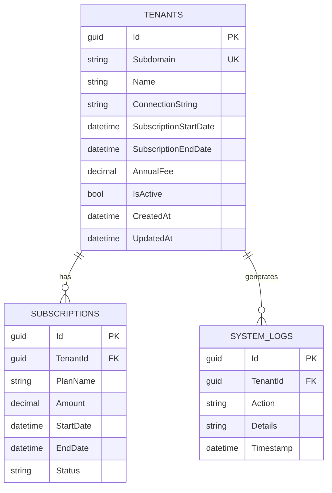
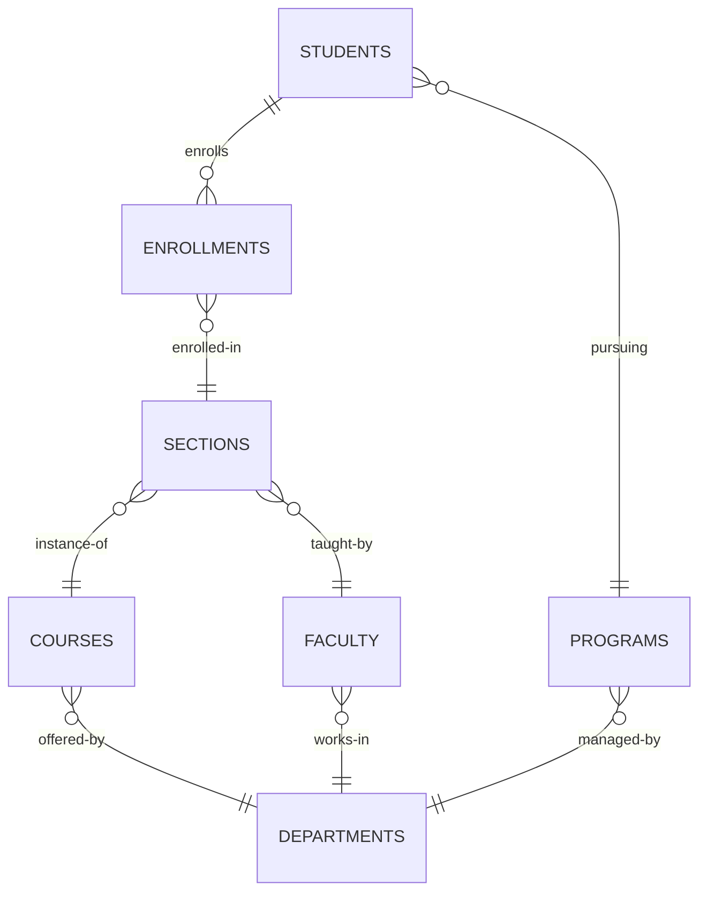
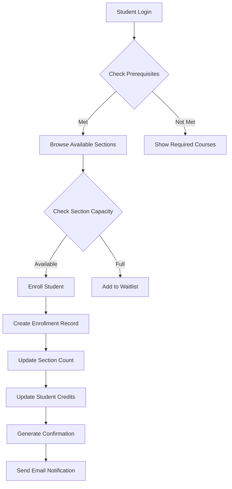
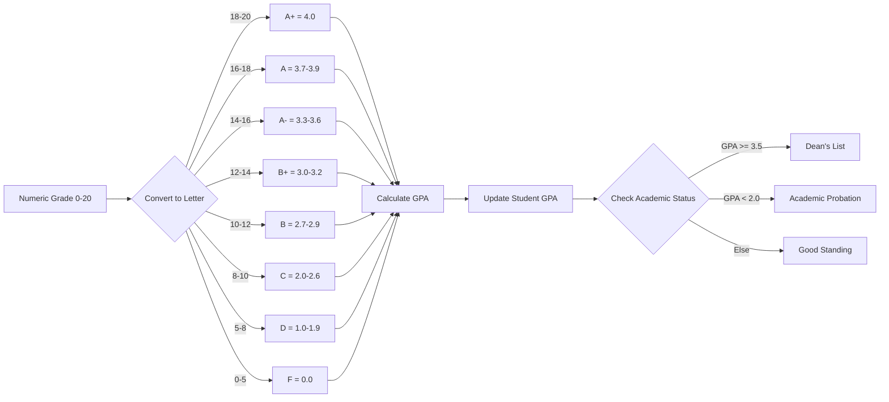
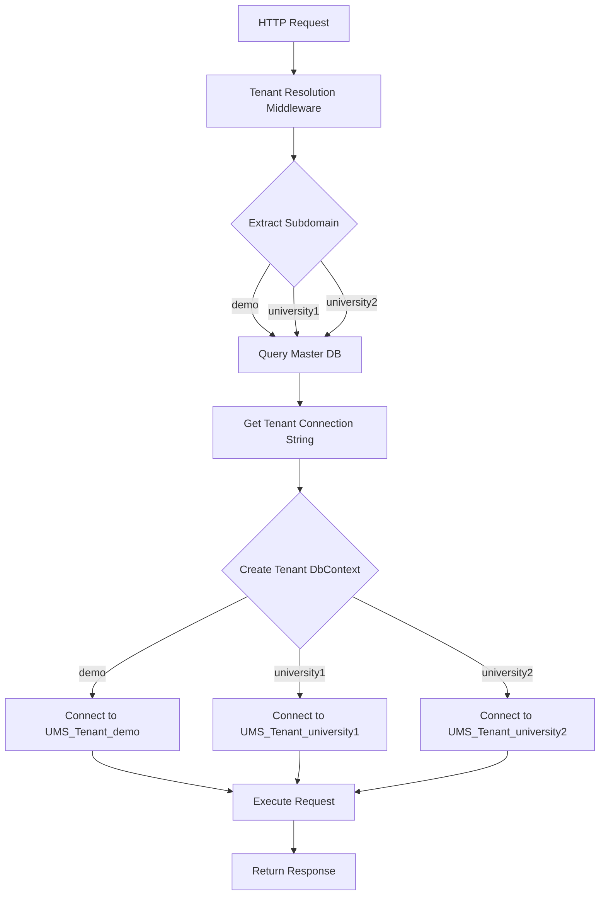
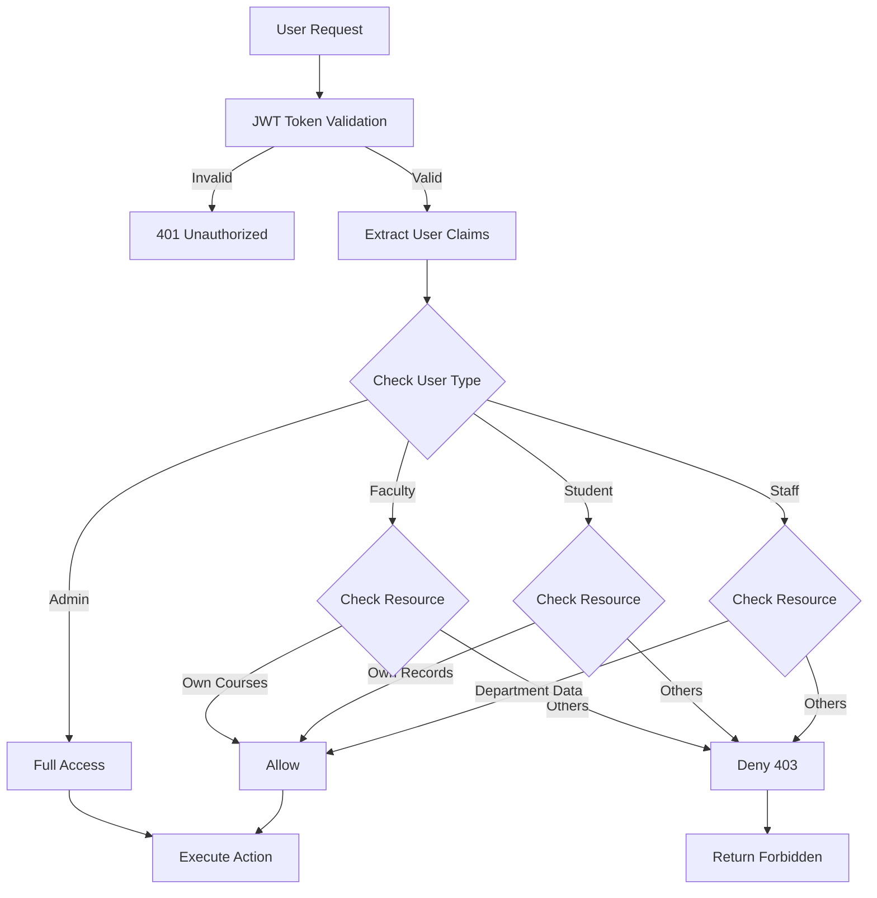
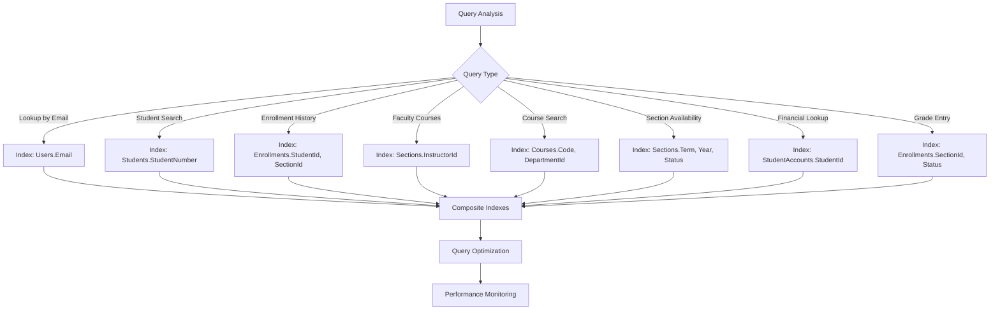

# UMS Database Schema - Complete ERD

## Master Database Schema



## Tenant Database Schema - Complete View

```mermaid
erDiagram
    %% ========================================
    %% IDENTITY & USERS
    %% ========================================
    
    USERS {
        guid Id PK
        string Email UK
        string PasswordHash
        string FirstName
        string LastName
        string PhoneNumber
        date DateOfBirth
        string ProfileImageUrl
        enum UserType
        bool IsActive
        bool EmailConfirmed
        datetime LastLoginAt
        datetime CreatedAt
        datetime UpdatedAt
        bool IsDeleted
    }
    
    STUDENTS {
        guid Id PK_FK
        string StudentNumber UK
        guid ProgramId FK
        guid AdvisorId FK
        datetime EnrollmentDate
        datetime ExpectedGraduationDate
        enum AcademicStatus
        decimal CurrentGPA
        int TotalCredits
    }
    
    FACULTY {
        guid Id PK_FK
        string EmployeeNumber UK
        guid DepartmentId FK
        enum Title
        datetime HireDate
        string OfficeLocation
        string OfficeHours
        string ResearchInterests
        int MaxCourseLoad
    }
    
    STAFF {
        guid Id PK_FK
        string EmployeeNumber UK
        guid DepartmentId FK
        string JobTitle
        datetime HireDate
    }
    
    %% ========================================
    %% ACADEMIC STRUCTURE
    %% ========================================
    
    DEPARTMENTS {
        guid Id PK
        string Code UK
        string Name
        string Description
        guid HeadOfDepartmentId FK
        string Building
        string Phone
        string Email
        decimal Budget
        datetime CreatedAt
        datetime UpdatedAt
        bool IsDeleted
    }
    
    PROGRAMS {
        guid Id PK
        string Code UK
        string Name
        guid DepartmentId FK
        enum DegreeType
        int DurationYears
        int RequiredCredits
        string Description
        bool IsActive
        datetime AccreditationDate
        datetime CreatedAt
        datetime UpdatedAt
        bool IsDeleted
    }
    
    COURSES {
        guid Id PK
        string Code UK
        string Name
        string Description
        int Credits
        guid DepartmentId FK
        int Level
        int MaxStudents
        bool IsActive
        datetime CreatedAt
        datetime UpdatedAt
        bool IsDeleted
    }
    
    COURSE_PREREQUISITES {
        guid CourseId PK_FK
        guid PrerequisiteCourseId PK_FK
        decimal MinimumGrade
    }
    
    PROGRAM_COURSES {
        guid Id PK
        guid ProgramId FK
        guid CourseId FK
        bool IsRequired
        int RecommendedYear
        enum RecommendedTerm
    }
    
    SECTIONS {
        guid Id PK
        guid CourseId FK
        string SectionNumber
        enum Term
        int Year
        guid InstructorId FK
        guid RoomId FK
        int MaxCapacity
        int CurrentEnrollment
        datetime StartDate
        datetime EndDate
        string MeetingDays
        string MeetingTime
        enum Status
        datetime CreatedAt
        datetime UpdatedAt
        bool IsDeleted
    }
    
    %% ========================================
    %% ENROLLMENT & GRADES
    %% ========================================
    
    ENROLLMENTS {
        guid Id PK
        guid StudentId FK
        guid SectionId FK
        datetime EnrollmentDate
        enum Status
        decimal NumericGrade
        enum LetterGrade
        decimal GradePoints
        string GradeComments
        datetime GradedAt
        guid GradedBy FK
        decimal AttendancePercentage
        decimal MidtermGrade
        datetime CreatedAt
        datetime UpdatedAt
        bool IsDeleted
    }
    
    ATTENDANCE {
        guid Id PK
        guid EnrollmentId FK
        date Date
        enum Status
        guid MarkedBy FK
        string Notes
        datetime CreatedAt
    }
    
    ASSIGNMENTS {
        guid Id PK
        guid SectionId FK
        string Title
        string Description
        decimal MaxPoints
        datetime DueDate
        enum Type
        decimal WeightPercentage
        datetime CreatedAt
        datetime UpdatedAt
        bool IsDeleted
    }
    
    STUDENT_ASSIGNMENTS {
        guid Id PK
        guid AssignmentId FK
        guid StudentId FK
        decimal Score
        datetime SubmittedAt
        guid GradedBy FK
        datetime GradedAt
        string Feedback
    }
    
    %% ========================================
    %% FINANCIAL MANAGEMENT
    %% ========================================
    
    TUITION_FEES {
        guid Id PK
        guid ProgramId FK
        string AcademicYear
        decimal TuitionAmount
        decimal PerCreditAmount
        datetime EffectiveDate
    }
    
    STUDENT_ACCOUNTS {
        guid Id PK
        guid StudentId FK
        decimal Balance
        datetime LastPaymentDate
        guid PaymentPlanId FK
    }
    
    TRANSACTIONS {
        guid Id PK
        guid StudentAccountId FK
        decimal Amount
        enum Type
        enum PaymentMethod
        string Description
        datetime TransactionDate
        guid ProcessedBy FK
        string ReceiptNumber
    }
    
    SCHOLARSHIPS {
        guid Id PK
        string Name
        decimal Amount
        enum Type
        string Criteria
        datetime DeadlineDate
        bool IsActive
    }
    
    STUDENT_SCHOLARSHIPS {
        guid Id PK
        guid StudentId FK
        guid ScholarshipId FK
        datetime AwardedDate
        string AcademicYear
        enum Status
    }
    
    %% ========================================
    %% RESOURCES & FACILITIES
    %% ========================================
    
    BUILDINGS {
        guid Id PK
        string Name
        string Code UK
        string Address
        string Description
    }
    
    ROOMS {
        guid Id PK
        guid BuildingId FK
        string RoomNumber
        int Capacity
        enum Type
        bool HasProjector
        bool HasComputers
        bool IsAccessible
    }
    
    EQUIPMENT {
        guid Id PK
        string Name
        enum Type
        string SerialNumber
        datetime PurchaseDate
        enum Status
        guid AssignedToRoomId FK
    }
    
    ROOM_BOOKINGS {
        guid Id PK
        guid RoomId FK
        guid BookedBy FK
        datetime StartDateTime
        datetime EndDateTime
        string Purpose
        enum Status
    }
    
    %% ========================================
    %% COMMUNICATION
    %% ========================================
    
    ANNOUNCEMENTS {
        guid Id PK
        string Title
        string Content
        enum Type
        guid PublishedBy FK
        datetime PublishedAt
        datetime ExpiresAt
        string TargetAudience
    }
    
    NOTIFICATIONS {
        guid Id PK
        guid UserId FK
        string Title
        string Message
        enum Type
        bool IsRead
        datetime CreatedAt
        datetime ReadAt
    }
    
    EMAIL_TEMPLATES {
        guid Id PK
        string Name UK
        string Subject
        string Body
        enum Type
        string Variables
    }
    
    %% ========================================
    %% ACADEMIC CALENDAR
    %% ========================================
    
    ACADEMIC_YEARS {
        guid Id PK
        string Year UK
        datetime StartDate
        datetime EndDate
        bool IsActive
    }
    
    TERMS {
        guid Id PK
        guid AcademicYearId FK
        string Name
        datetime StartDate
        datetime EndDate
        datetime RegistrationStartDate
        datetime RegistrationEndDate
        datetime DropAddDeadline
        datetime WithdrawalDeadline
    }
    
    IMPORTANT_DATES {
        guid Id PK
        guid TermId FK
        string Title
        datetime Date
        enum Type
        string Description
    }
    
    %% ========================================
    %% ADVISING & STUDENT SERVICES
    %% ========================================
    
    ADVISORS {
        guid FacultyId PK_FK
        guid StudentId PK_FK
        datetime AssignedDate
        bool IsActive
    }
    
    ADVISING_APPOINTMENTS {
        guid Id PK
        guid StudentId FK
        guid AdvisorId FK
        datetime ScheduledAt
        int Duration
        string Notes
        enum Status
        datetime CreatedAt
    }
    
    ADVISING_NOTES {
        guid Id PK
        guid StudentId FK
        guid AdvisorId FK
        string Note
        enum Category
        datetime CreatedAt
    }
    
    DEGREE_AUDITS {
        guid Id PK
        guid StudentId FK
        guid ProgramId FK
        int CompletedCredits
        int RequiredCredits
        string MissingCourses
        datetime GeneratedAt
        guid GeneratedBy FK
    }
    
    %% ========================================
    %% AUDIT & SYSTEM
    %% ========================================
    
    AUDIT_LOGS {
        guid Id PK
        guid UserId FK
        string Action
        string EntityType
        guid EntityId
        string OldValues
        string NewValues
        string IpAddress
        datetime Timestamp
    }
    
    SYSTEM_SETTINGS {
        string Key PK
        string Value
        string Description
        datetime UpdatedAt
    }
    
    %% ========================================
    %% RELATIONSHIPS
    %% ========================================
    
    %% User Inheritance
    USERS ||--o| STUDENTS : "is-a"
    USERS ||--o| FACULTY : "is-a"
    USERS ||--o| STAFF : "is-a"
    
    %% Academic Structure
    DEPARTMENTS ||--o{ PROGRAMS : "offers"
    DEPARTMENTS ||--o{ COURSES : "offers"
    DEPARTMENTS ||--o| FACULTY : "heads"
    DEPARTMENTS ||--o{ FACULTY : "employs"
    DEPARTMENTS ||--o{ STAFF : "employs"
    
    PROGRAMS ||--o{ STUDENTS : "enrolled-in"
    PROGRAMS ||--o{ TUITION_FEES : "has"
    PROGRAMS ||--o{ PROGRAM_COURSES : "requires"
    PROGRAMS ||--o{ DEGREE_AUDITS : "tracks"
    
    COURSES ||--o{ SECTIONS : "offered-as"
    COURSES ||--o{ COURSE_PREREQUISITES : "requires"
    COURSES ||--o{ COURSE_PREREQUISITES : "is-prerequisite"
    COURSES ||--o{ PROGRAM_COURSES : "belongs-to"
    
    %% Sections & Enrollment
    SECTIONS ||--o{ ENROLLMENTS : "has"
    SECTIONS }o--|| FACULTY : "taught-by"
    SECTIONS }o--o| ROOMS : "held-in"
    SECTIONS ||--o{ ASSIGNMENTS : "has"
    
    STUDENTS ||--o{ ENROLLMENTS : "enrolls-in"
    STUDENTS }o--o| FACULTY : "advised-by"
    STUDENTS ||--o{ STUDENT_ACCOUNTS : "has"
    STUDENTS ||--o{ STUDENT_SCHOLARSHIPS : "receives"
    STUDENTS ||--o{ STUDENT_ASSIGNMENTS : "submits"
    STUDENTS ||--o{ ADVISORS : "advised-by"
    STUDENTS ||--o{ ADVISING_APPOINTMENTS : "schedules"
    STUDENTS ||--o{ ADVISING_NOTES : "has"
    STUDENTS ||--o{ DEGREE_AUDITS : "generates"
    
    ENROLLMENTS ||--o{ ATTENDANCE : "tracks"
    ENROLLMENTS }o--o| FACULTY : "graded-by"
    
    %% Assignments
    ASSIGNMENTS ||--o{ STUDENT_ASSIGNMENTS : "submitted-for"
    STUDENT_ASSIGNMENTS }o--|| FACULTY : "graded-by"
    
    %% Financial
    STUDENT_ACCOUNTS ||--o{ TRANSACTIONS : "has"
    SCHOLARSHIPS ||--o{ STUDENT_SCHOLARSHIPS : "awarded-as"
    TRANSACTIONS }o--|| STAFF : "processed-by"
    
    %% Resources
    BUILDINGS ||--o{ ROOMS : "contains"
    ROOMS ||--o{ SECTIONS : "hosts"
    ROOMS ||--o{ ROOM_BOOKINGS : "booked"
    ROOMS ||--o{ EQUIPMENT : "contains"
    USERS ||--o{ ROOM_BOOKINGS : "books"
    
    %% Communication
    USERS ||--o{ ANNOUNCEMENTS : "publishes"
    USERS ||--o{ NOTIFICATIONS : "receives"
    
    %% Calendar
    ACADEMIC_YEARS ||--o{ TERMS : "contains"
    TERMS ||--o{ IMPORTANT_DATES : "has"
    
    %% Advising
    FACULTY ||--o{ ADVISORS : "advises"
    FACULTY ||--o{ ADVISING_APPOINTMENTS : "meets"
    FACULTY ||--o{ ADVISING_NOTES : "writes"
    FACULTY ||--o{ ATTENDANCE : "marks"
    
    %% Audit
    USERS ||--o{ AUDIT_LOGS : "performs"
    STAFF ||--o{ DEGREE_AUDITS : "generates"
```

## Simplified View - Core Academic Flow



## Data Flow - Student Registration Process



## Grading System Flow - French (0-20) Scale



## Multi-Tenant Architecture



## Security & Authorization Flow



## Database Indexing Strategy



---

## Database Statistics (Projected)

| Entity | Estimated Rows (1000 students) | Growth Rate |
|--------|-------------------------------|-------------|
| Users | 1,200 | 20%/year |
| Students | 1,000 | 15%/year |
| Faculty | 150 | 5%/year |
| Staff | 50 | 3%/year |
| Departments | 10 | Stable |
| Programs | 25 | 2%/year |
| Courses | 500 | 5%/year |
| Sections | 2,000 | 10%/year |
| Enrollments | 20,000 | 15%/year |
| Attendance | 400,000 | 15%/year |
| Transactions | 5,000 | 20%/year |
| Assignments | 8,000 | 10%/year |
| Audit Logs | 50,000 | 30%/year |

---

## Storage Requirements (Estimated)

| Component | Size (1000 students) | Size (5000 students) |
|-----------|---------------------|----------------------|
| Master DB | 50 MB | 200 MB |
| Tenant DB (each) | 2 GB | 10 GB |
| Attachments (blob) | 50 GB | 250 GB |
| Backups (daily) | 5 GB | 25 GB |
| Logs (monthly) | 500 MB | 2.5 GB |
| **Total** | **~60 GB** | **~290 GB** |

